---
# Title: Exercise Tracker

### Author: Umang Mehta (7885176)

#### Date: November 24, 2025

# Overview

Exercise Tracker is an implementation of real apps like Starva and Apple Fitness for COMP 2450 in FALL 2025.
However, due to accessibility issues and knowledge limitations, we're using a grid system instead of a real 
Map and GPS to record and track our data. The program begins as just you've finished a workout and came on
your desk to enter all details about it.

* In this updated phase, As you being you're asked either to Create Profile or sign in if you have existing file.
* After signing in successfully you're able to see feed of the people you follow, add/remove follower, manage your current profile.
* Under managing your profile you'll be able to add activites, add/remove obstacles, add/remove gears.
* The new thing about adding activity here would be you can now choose they you want to find the Route. 
* Either you can enter manually, choose from your existing activites or enter starting and ending points for your route system will find a route for you from either of your existing one's or the follower's list. 

# Flows of interaction

## Diagrams

### Login Page

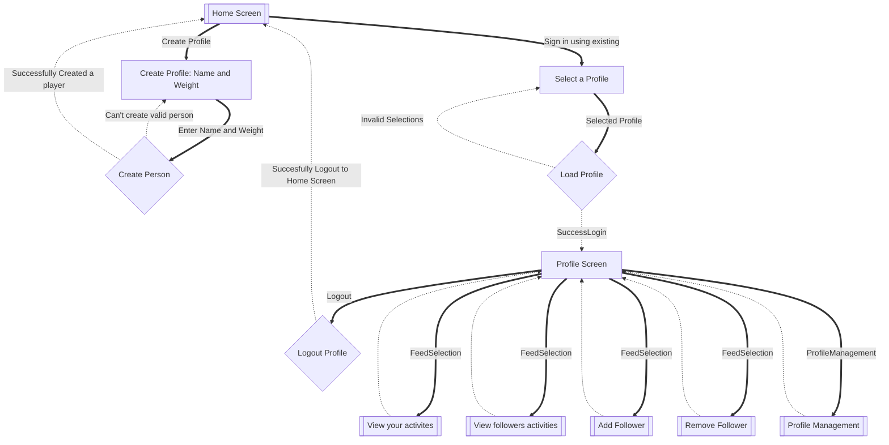

### View your activities

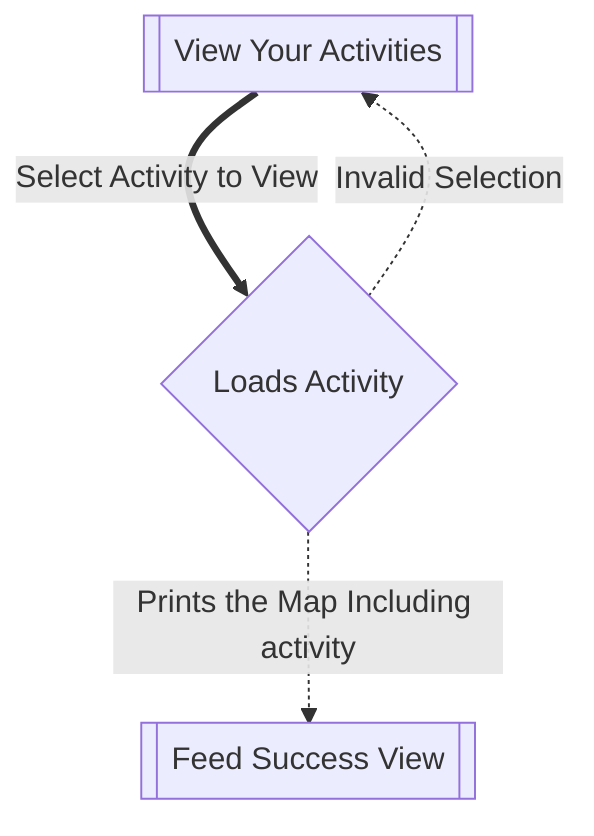

### View Followers Activities
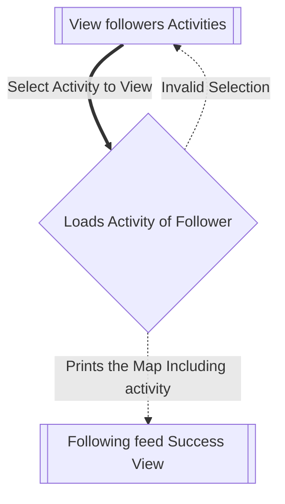
### Add Follower

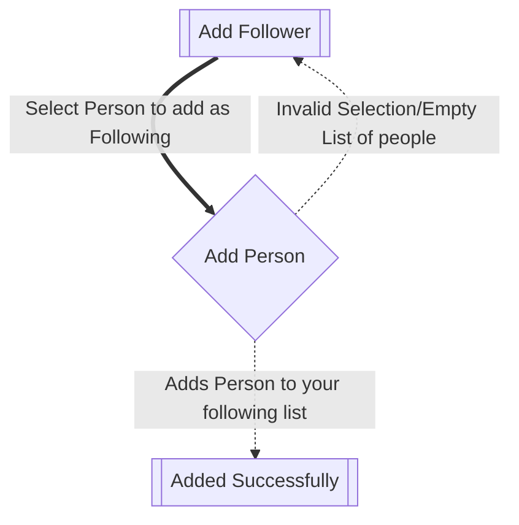
### Remove Follower

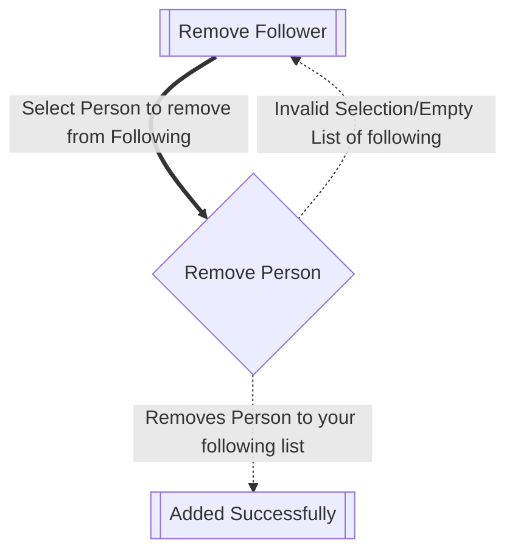

### Profile Management

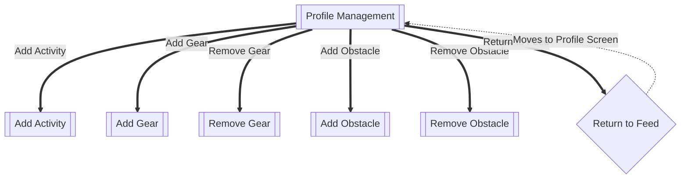
### Add Gears

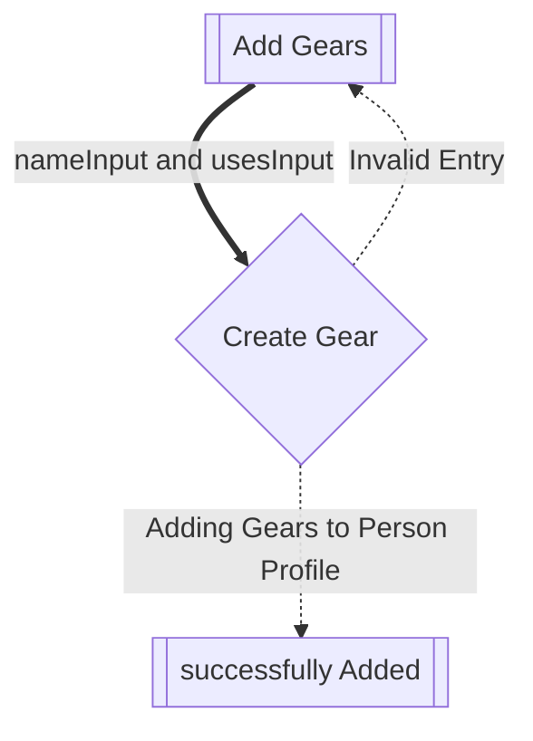

### Remove Gears

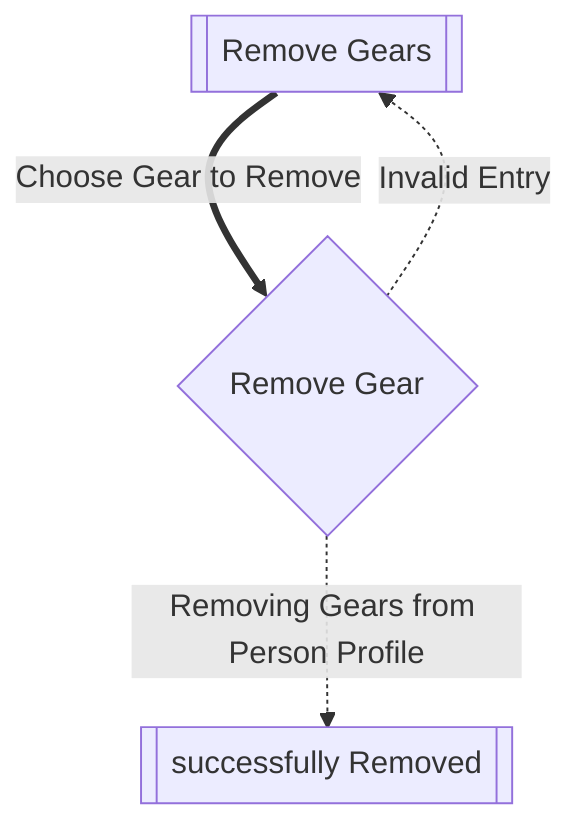
### Add Obstacle
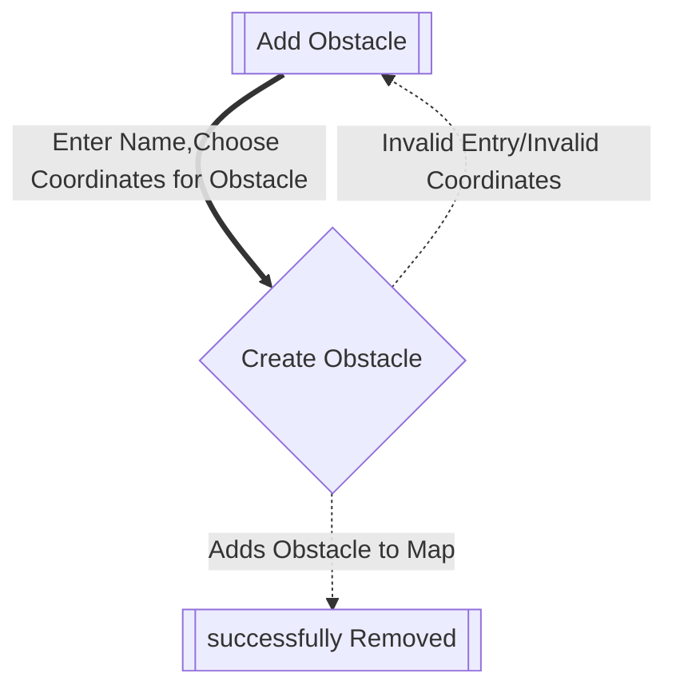

### Remove Obstacle

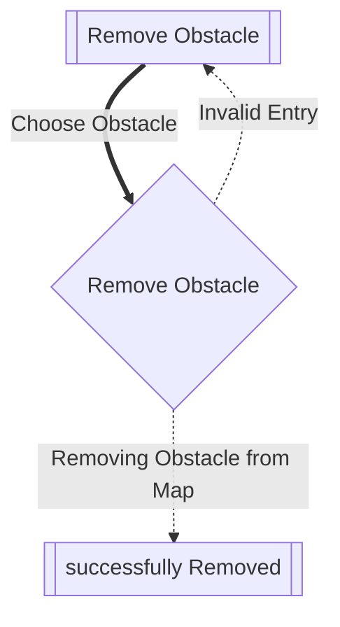
### Creating Actvity

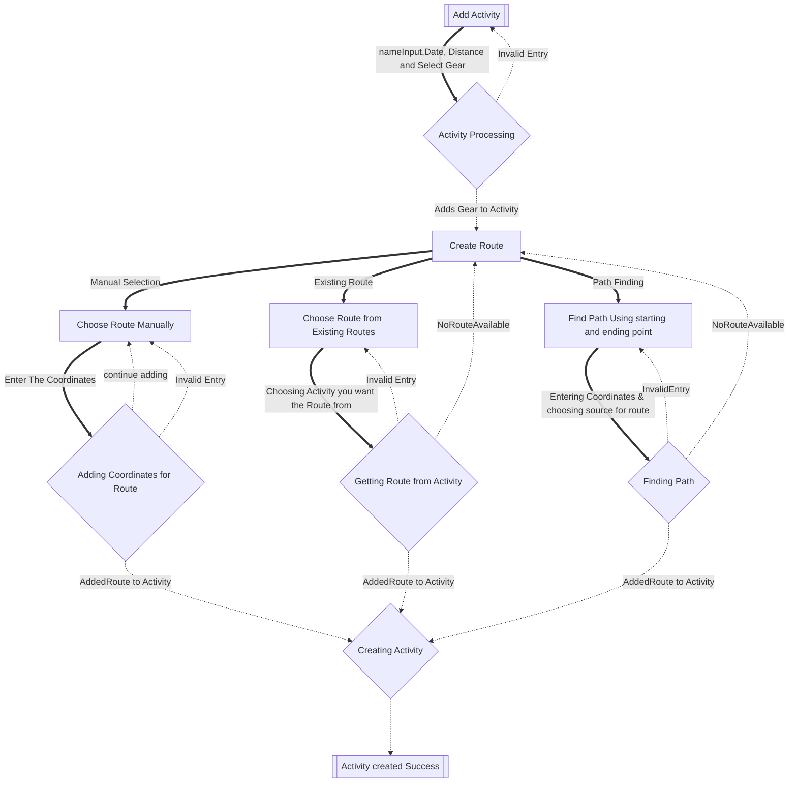

## Resources
* Franklin's Repository - Literally The biggest help I could have used. 
* Stack interface was taken from 
<https://code.cs.umanitoba.ca/comp2450-fall2025/2450-stack/-/blob/main/src/main/java/ca/umanitoba/cs/umbrist1/generics/stacks/Stack.java>


Some notable components include:

* [Subgraph (for entire tasks)](https://mermaid.js.org/syntax/flowchart.html#subgraphs)
* [Double rectangle (start/end subtasks)](https://mermaid.js.org/syntax/flowchart.html#a-node-in-a-subroutine-shape)
* [Diamond (for processing)](https://mermaid.js.org/syntax/flowchart.html#decision-diamond)
* [Styling lines (scroll down, there's a table! thick lines for input, dashed lines for outputs)](https://mermaid.js.org/syntax/flowchart.html#minimum-length-of-a-link)


## Phase 2 Changes

- Implementation of UI and Logic layers was done, in which UI was reponsible for Validation and Logic Layer was used for processing and returning Domain Model Objects.
- Logic Layers updated/changed the state of my Domain model objects.
- All Validations eg: If it's a valid selection was done inside the UI
- A lot of methods were taken off form the domain model object and were directly put inside the Logic class
- Map here has became the basic example of Single Responsibility Principle and list of activates were taken and were processed by Logic now.
- Direct instantiation of the domain model object were removed and were made through Builders
- Coordinate which was a record before was changed to a class for the same building reason.
- We now had a thing where like in real life we can follow people and look there feed which includes exercise they did.
- A person now can remove/add followers with all powers same as phase 1
- Map has now been hard-coded so that it can be used globally by anyone using the software, we have a common map
- For adding activities now we have three different ways, which were choosing manually, choose from User's existing, and Path finding.
- For path finding we created algorithm that would ask for first and last coordinates you want and choose the way you want to exlore the route.
- Path could be chose either from the followers list or the self's list of activities done.
- Lastly, for the route finding algorithm Stack and linked list(self-created) was used to implement alg.


[Starva]: https://en.wikipedia.org/wiki/Strava
[Apple Fitness]: https://en.wikipedia.org/wiki/Fitness_(Apple)

## Running

This project was developed using IntelliJ IDEA and uses Maven, so there are two
ways to run it:

1. Open the class called `Main` and click the green play button on the
   `main`method, or
2. Run Maven on the command line:
   
```
mvn compile exec:java -Dexec.mainClass="comp2450.Main"
```

# Domain model

## Resources
* I learnt some important concepts of domain modeling at: 
<https://www.thoughtworks.com/en-ca/insights/blog/agile-project-management/domain-modeling-what-you-need-to-know-before-coding>

* Making records was not an easy task and direct help was used from :
<https://dev.java/learn/records/>

* This Phase 2 has been quite intense, not a lot of questions but a lot of thinking and working on real stuff
* AI Disclaimer: All implementations and logic were self created, all logic layer to UI were created, however some syntax's were asked form ChatGPT like the new Switch learnt, 
* I also tend to learn some understanding of Logic and UI but never shared the code, some technical and basic questions were asked that helped building some stuff but never asked for any code.
* Questions like: can we have multiple logic layers, inside logic layers, how would that affect the design and many more. But NO CODE/ LOGIC was taken. 
* Some design patterns were learnt too. 

* For learning More about Layers a Youtube channel was used :
<https://www.youtube.com/@ApnaCollegeOfficial>

* Mermaid's Syntax for class diagrams was not a piece of cake, used this as s guide: 
<https://mermaid.js.org/syntax/classDiagram.html>

* To learn about new classes and frameworks used like: LocalDateTime, TreeSet, Lists :
 <https://docs.oracle.com/javase/8/docs/api/allclasses-noframe.html>

* Computer Science help centre people have been a great help as well as my those classmates who did clear a lot of questions. 

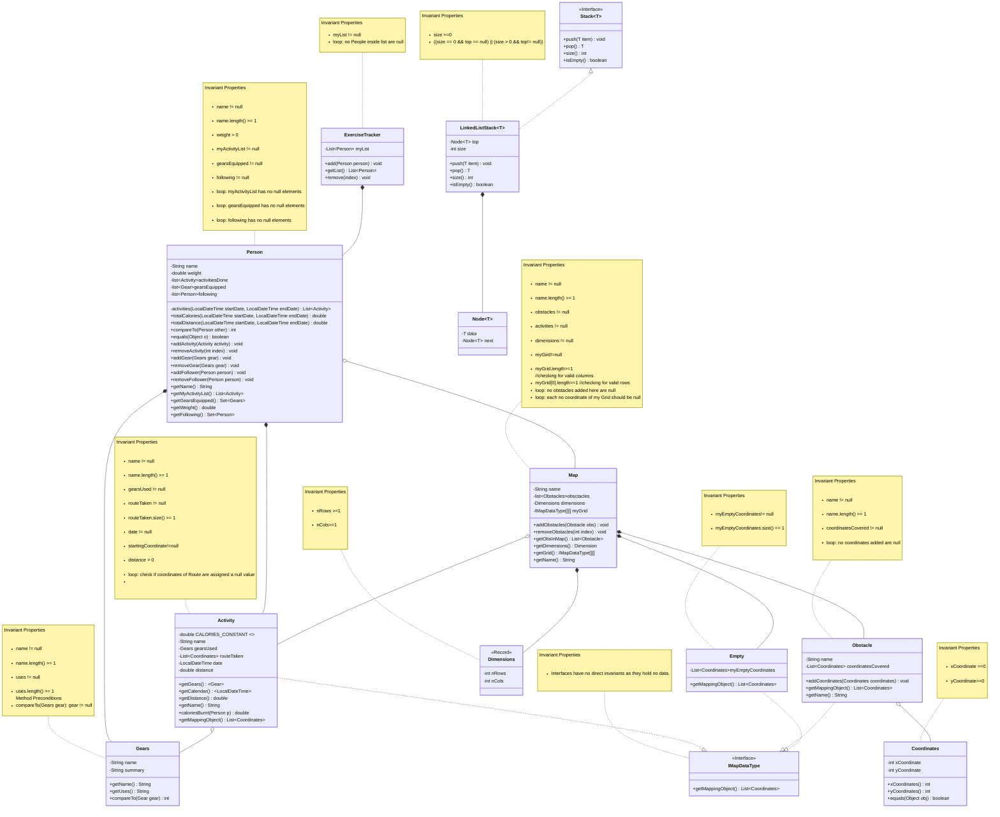


