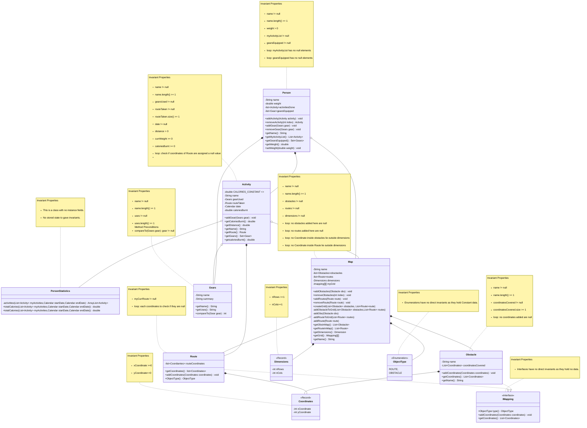

---
# Title: Exercise Tracker

### Author: Umang Mehta (7885176)

#### Date: October 8, 2025

# Overview

Exercise Tracker is an implementation of real apps like Starva and Apple Fitness for COMP 2450 in FALL 2025.
However due to accessibility issues and knowledge limitations, we're using a grid system instead of a real 
Map and GPS to record and track our data. The program begins as just you've finished a workout and came on
your desk to enter all details about it.

* As you begin, it records your information as in Starva/Apple fitness( Here it asks for name and weight).
* There is MAP which creates a Grid with Rows and Coloumns defined by the user along with user defined obstacles.   
* Track workouts including the gears used and the route taken. 
* The goal is to have your data stored and print them when you need details. (Example: Viewing the data within user specified date range)

[Starva]: https://en.wikipedia.org/wiki/Strava
[Apple Fitness]: https://en.wikipedia.org/wiki/Fitness_(Apple)

## Running

This project was developed using IntelliJ IDEA and uses Maven, so there are two
ways to run it:

1. Open the class called `Main.java` and click the green play button on the
   `main`method, or
2. Run Maven on the command line:
   
```
mvn compile exec:java -Dexec.mainClass="comp2450.Main"
```

# Domain model

## Resources
* I learnt some important concepts of domain modeling at: 
<https://www.thoughtworks.com/en-ca/insights/blog/agile-project-management/domain-modeling-what-you-need-to-know-before-coding>

* Making records was not an easy task and direct help was used from :
<https://dev.java/learn/records/>

* Discussion forums were a BIG part of learning, along with discussion with classmates which continuously led me implement the 
changes and learning new stuff. (luckily there's no e-Link for friends).

* Mermaid's Syntax for class diagrams was not a piece of cake, used this as s guide: 
<https://mermaid.js.org/syntax/classDiagram.html>

* To learn about new classes and frameworks used like: Calendar, TreeSet, Lists :
 <https://docs.oracle.com/javase/8/docs/api/allclasses-noframe.html>

* To be honest chatGPT helped me study a lot about topics and definitions by being concise to the topic and in easy and understandable english words.
* I explored multiple approaches for creating the grid. Initially I had one idea, but after discussion with classmates and reviewing suggestions from Professor and examples from ChatGPT.
* I implemented an interface-based solution. ( No snippet was taken from anywhere, totally own work after learning implementations.)



